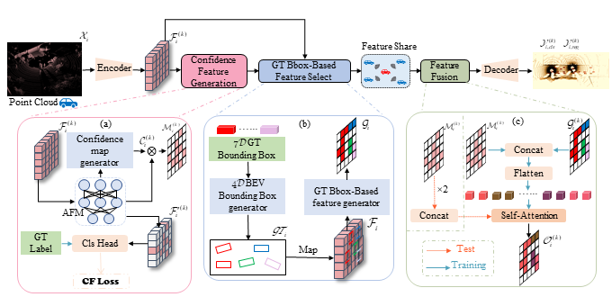
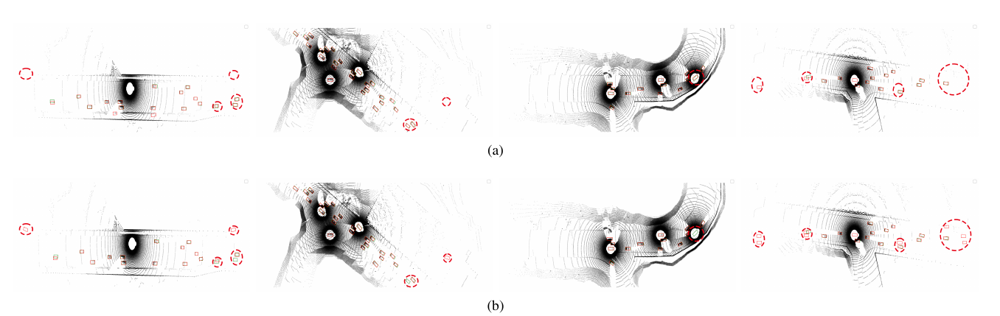

from opencood.models.fuse_modules.fast2comm_fuse import Fast2comm

# Fast2comm

The official implementation of the paper "Fast2comm:Collaborative perception combined with prior knowledge".
<div align="center">
  
  <div>&nbsp;</div>
  
  <div>&nbsp;</div>
</div>

> [**Fast2comm:Collaborative perception combined with prior knowledge**]          
>  Zhengbin Zhang, Yan Wu\*, Hongkun Zhang<br>


## Abstract

Collaborative perception has the potential to significantly enhance perceptual accuracy through the sharing of complementary information among agents. However, real-world collaborative perception faces persistent challenges, particularly in balancing perception performance and bandwidth limitations, as well as coping with localization errors. To address these challenges, we propose \textit{Fast2comm}, a prior knowledge-based collaborative perception framework. Specifically, (1)~we propose a prior-supervised confidence feature generation method, that effectively distinguishes foreground from background by producing highly discriminative confidence features; (2)~we propose GT Bounding Box-based spatial prior feature selection strategy to ensure that only the most informative prior-knowledge features are selected and shared, thereby minimizing background noise and optimizing bandwidth efficiency while enhancing adaptability to localization inaccuracies; (3)~we decouple the feature fusion strategies between model training and testing phases, enabling dynamic bandwidth adaptation. To comprehensively validate our framework, we conduct extensive experiments on both real-world and simulated datasets. The results demonstrate the superior performance of our model and highlight the necessity of the proposed methods.

## Installation
Please refer to [data introduction](https://opencood.readthedocs.io/en/latest/md_files/data_intro.html)
and [installation](https://opencood.readthedocs.io/en/latest/md_files/installation.html) guide to prepare
data and install OpenCOOD. To see more details of OPV2V data, please check [the website.](https://mobility-lab.seas.ucla.edu/opv2v/)

## Supported multi-agent perception dataset:
  - [x] [OPV2V [ICRA2022]](https://mobility-lab.seas.ucla.edu/opv2v/)
  - [x] [V2XSet [ECCV2022]](https://arxiv.org/pdf/2203.10638.pdf)
  - note: For experiments on DAIR-V2X, please utilize the [CoAlign](https://github.com/yifanlu0227/CoAlign) framework.
## Quick Start
### Data sequence visualization
To quickly visualize the LiDAR stream in the OPV2V dataset, first modify the `validate_dir`
in your `opencood/hypes_yaml/visualization.yaml` to the opv2v data path on your local machine, e.g. `opv2v/validate`,
and the run the following commond:
```python
cd ~/Fast2comm
python opencood/visualization/vis_data_sequence.py [--color_mode ${COLOR_RENDERING_MODE}]
```
Arguments Explanation:
- `color_mode` : str type, indicating the lidar color rendering mode. You can choose from 'constant', 'intensity' or 'z-value'.


### Train your model
Fast2comm uses yaml file to configure all the parameters for training. To train your own model
from scratch or a continued checkpoint, run the following commonds:
```python
python opencood/tools/train.py --hypes_yaml ${CONFIG_FILE} [--model_dir  ${CHECKPOINT_FOLDER} --half]
```
Arguments Explanation:
- `hypes_yaml`: the path of the training configuration file, e.g. `opencood/hypes_yaml/second_early_fusion.yaml`, meaning you want to train
an early fusion model which utilizes SECOND as the backbone. See [Tutorial 1: Config System](https://opencood.readthedocs.io/en/latest/md_files/config_tutorial.html) to learn more about the rules of the yaml files.
- `model_dir` (optional) : the path of the checkpoints. This is used to fine-tune the trained models. When the `model_dir` is
given, the trainer will discard the `hypes_yaml` and load the `config.yaml` in the checkpoint folder.
- `half` (optional): If set, the model will be trained with half precision. It cannot be set with multi-gpu training togetger.

To train on **multiple gpus**, run the following command:
```
CUDA_VISIBLE_DEVICES=0,1,2,3 python -m torch.distributed.launch --nproc_per_node=4  --use_env opencood/tools/train.py --hypes_yaml ${CONFIG_FILE} [--model_dir  ${CHECKPOINT_FOLDER}]
```


### Test the model
Before you run the following command, first make sure the `validation_dir` in config.yaml under your checkpoint folder
refers to the testing dataset path, e.g. `opv2v_data_dumping/test`.

```python
python opencood/tools/inference.py --model_dir ${CHECKPOINT_FOLDER} --fusion_method ${FUSION_STRATEGY} [--show_vis] [--show_sequence]
```
Arguments Explanation:
- `model_dir`: the path to your saved model.
- `fusion_method`: indicate the fusion strategy, currently support 'early', 'late', and 'intermediate'.
- `show_vis`: whether to visualize the detection overlay with point cloud.
- `show_sequence` : the detection results will visualized in a video stream. It can NOT be set with `show_vis` at the same time.
- `global_sort_detections`: whether to globally sort detections by confidence score. If set to True, it is the mainstream AP computing method, but would increase the tolerance for FP (False Positives). **OPV2V paper does not perform the global sort.** Please choose the consistent AP calculation method in your paper for fair comparison.

The evaluation results  will be dumped in the model directory.
## Checkpoint
Fast2comm on OPV2V and V2XSet dataset:(https://www.alipan.com/t/DXPTl3LcDnQ180Gkimec)

## Acknowledgment
Many thanks to the high-quality dataset and codebase, including [V2XSet](https://drive.google.com/drive/folders/1r5sPiBEvo8Xby-nMaWUTnJIPK6WhY1B6), [OPV2V](https://drive.google.com/drive/folders/1dkDeHlwOVbmgXcDazZvO6TFEZ6V_7WUu), [OpenCOOD](https://github.com/DerrickXuNu/OpenCOOD) and  [Where2comm](https://github.com/MediaBrain-SJTU/Where2comm.git).
